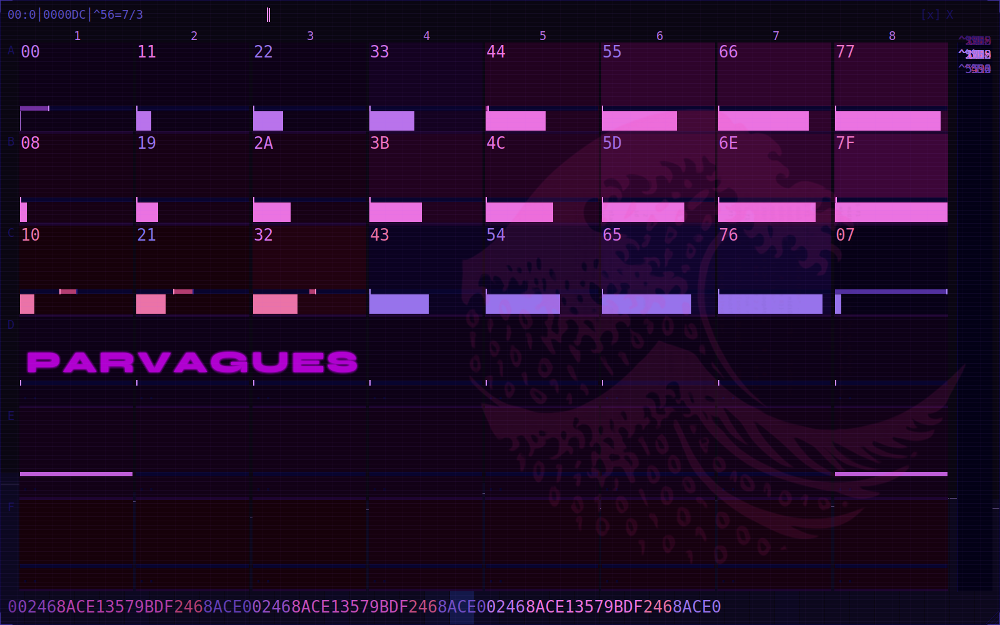
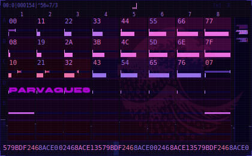
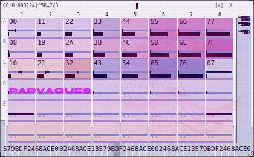
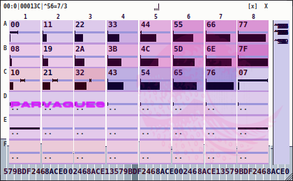

# midiviz

**Live MIDI as a picture.**

A MIDI fader sweep emits ~400 events a second. A transcript of those events is
the right shape for a debugger and the wrong shape for a performer: during a
set nobody reads sentences, so the words scroll past faster than an eye can
land on them.

midiviz is a lens built for that moment. Zero English words render on the
canvas: an event's identity is its **position**, its type is a **glyph class**,
its value is a **bar plus two hex digits**, and its recency is **brightness**.
The layout is the authored control surface itself, rows A..F down, columns
1..8 across, so a glance answers "which orbit did I just touch" without
decoding anything. (Orbit: the Tidal livecoding term for one pattern's voice;
column N is orbit N.) Only what the grid cannot place (foreign CCs, notes,
bend, program) falls as rain in the right-hand gutter, which is itself the
signal: that came from somewhere else.

It was born in ParVagues' livecoding rig, watching a Novation
**Launch Control XL 3**. It watches any MIDI source, and its branding is yours
to change.



## Highlights

- **The grid is the surface.** Column N is orbit N; the picture is the
  authored LCXL3 control layout (`lcxl_grid.py`), not an arbitrary CC table.
- **Mapped-but-idle is never black.** Every grid cell keeps a floor tint, so a
  connected-but-untouched control never reads as a hardware fault.
- **Resting state, not just events.** MIDI is edge-triggered, so a filter
  parked at zero and one parked at the top look identical once the glow fades.
  If a driver publishes a state file (last-value-wins, atomically written),
  midiviz paints what each control is *resting at*: three zones for the
  centre-detented family filters, detent drawn.
- **Three themes**: `dark` (the cockpit), `light` (pale desktop), `sun`
  (near-white, heavy ink, for playing outdoors). Colours are data; every
  theme is held to the same visibility contract by the test suite.
- **Two frame rates, never a busy loop.** ~30 fps while events arrive, 5 fps
  two seconds after the last one, precomputed colour LUTs, zero per-frame
  allocation. Built on a machine that performs live audio.
- **Spectrum backdrop** (optional, `s`): the master bus, behind the grid.
- **Tidal orbit feed** (optional, `h`): which orbits the music is actually
  triggering right now, via a SuperDirt OSC mirror. This is the answer to
  "I turned the knob and nothing happened: is the pattern silent, or is the
  knob not wired?"
- **Survives everything**: unplug/replug (clean-exit-proof by design),
  restarts (theme + scale persist), tiling WMs (the window's size belongs to
  the WM, the type density to the window), duplicate launches (flock, exit 78,
  so a deliberate close is never treated as a fault).

## The three themes

| dark, the cockpit | light, pale desktop | sun, outdoors |
|---|---|---|
|  |  |  |

## Install and run

Needs Python ≥ 3.10, [PySide6](https://pypi.org/project/PySide6/), and
`aseqdump` (Debian/Ubuntu: `sudo apt install alsa-utils`).

```sh
git clone https://github.com/PLNech/midiviz.git
cd midiviz
python3 midiviz.py
```

```sh
python3 midiviz.py -l              # list MIDI ports, show what it would watch
python3 midiviz.py -p 28:0         # pin a source port
python3 midiviz.py --theme sun     # near-white, for playing outdoors
python3 midiviz.py --spectro       # + master-bus spectrum, behind the grid
python3 midiviz.py --selftest      # 3 s of synthetic events, headless
```

Keys: `q`/`Esc` quit · `p` pause · `c` clear · `s` spectrum · `t` pin ·
`d` theme · `+`/`-` type density · `0` birth size · `w` wave · `l` lettering.
Drag the body to move, the edges and corners to resize (the type follows the
window); right-click for the menu (also in the system tray).

Tested on Linux/ALSA (Wayland and X11). Ports are resolved automatically: a
translated/virtual surface port is preferred over raw hardware ports.

## Make it yours (branding)

midiviz ships wearing **ParVagues**, and changing the name changes nothing
about how it works:

```sh
MIDIVIZ_BRAND="Coolnaut" \
MIDIVIZ_WORDMARK="COOLNAUT" \
MIDIVIZ_BRAND_SLUG="coolnaut" \
MIDIVIZ_WAVE=$HOME/pictures/coolnaut-wave.png \
python3 midiviz.py
```

- `MIDIVIZ_BRAND` is the spoken name (menu labels)
- `MIDIVIZ_WORDMARK` is the block lettering drawn over row D
- `MIDIVIZ_BRAND_SLUG` is the directory under `$XDG_CONFIG_HOME` /
  `$XDG_RUNTIME_DIR` for the saved theme, scale, close latch and instance
  lock (one per brand)
- `MIDIVIZ_WAVE` is any transparent PNG, watermarked faintly behind the grid

## The wire

State has a single legitimate owner, and it is not the viewer. midiviz reads
two optional producers, and both are plain files, so `cat` is the debugger:

| path | producer | shape |
|---|---|---|
| `~/.cache/parvagues/surface-state.json` | any driver that integrates relative encoders and owns the absolute values | 32 values, last-value-wins, monotonic `seq`, written atomically |
| `~/.cache/parvagues/eval-events.jsonl` | an editor publishing which orbits the loaded track triggers | one JSON object per line: `{"t":…, "path":…, "d":["d1",…]}` |

Missing files are fine: those layers simply stay dark. The parvagues paths are
the wire contract midiviz was born on, not branding. Point your own producer
at the same paths, or run everything under your own `MIDIVIZ_BRAND_SLUG` and
write the state file there.

A reference producer for the LCXL3 (delta integration, translated CC corpus)
lives in the ParVagues rig repository and is not required to run midiviz: on a
raw LCXL3 the event grid, gutter, spectrum and themes all work standalone.

## Development

```sh
python3 -m pytest tests/              # the non-drawing contracts (no Qt needed to fail fast)
python3 midiviz.py --selftest --screenshot shots/
                                      # real paint path, headless; PNGs per theme
```

`--selftest` is the drawing prover: it renders synthetic events through the
real parser, cycles every theme, resizes through the tiling-WM shapes and
checks the paint output. Green tests on pure functions say little about a
window, so this drives the window itself.

Layout, one screenful:

| file | role |
|---|---|
| `midiviz.py` | the lens: reader, widget, themes, state layer, selftest |
| `midimon.py` | the one parser (`parse_line` / `enrich` / port resolution) |
| `midistream.py` | threaded `aseqdump` reader |
| `lcxl_grid.py` | THE grid, authored once; everything derives from it |
| `oscfeed.py` | the Tidal orbit feed (SuperDirt OSC mirror) |
| `ui/` | vendored brand assets: wave PNG, display font (Syne 800) |
| `packaging/` | example systemd user unit + desktop entry |

## License

GPL-3.0-or-later, see [LICENSE](LICENSE).
